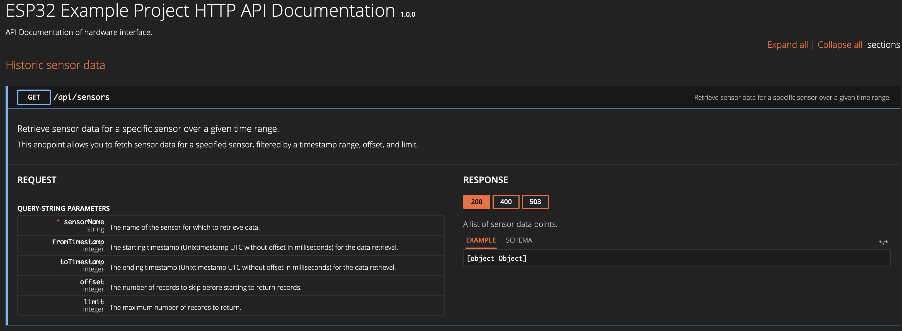

# ESP32 Host an sqlite database and serve large datasets via a paginated HTTP API endpoint with chunked transfer encoding

## About
The wifi-enabled esp32 microcontroller opened up great possibilities for embedded systems, especially in the context of IoT applications. The integration of sqlite enhances the very limited storage capabilities of embedded systems. Some projects may require a long term offline storage for historic sensor data, advanced data queries or simply some sort of persistent storage that can hold data across reboots of the IoT device. The purpose of this repository is to demonstrate how to utilize sqlite and an asynchronous webserver on the esp32 microcontroller to overcome the very limited storage limitations in embedded IoT projects.

## Hardware requirements
This project is designed to work with ESP32 microcontroller. A micro sd card is connected to the microcontroller via the SPI bus, although this is not a hard requirement.
An SQLite database could theoretically live on the internal storage of the microcontroller (e.g SPIFFS partition). This works fine for small datasets. If you need to store large amounts of data a micro sd card is the perfect choice.

## Storing data
The PersistenceManager() is designed to insert sensor data into sqlite database tables every minute.
For every sensor a database is created (in this example "esp32_chip_temperature", "esp32_system_uptime_millis" and "esp32_millivolts_pin").
This approach improves query performance drastically and makes sure to maintain a small database file size for every sensor.

## Process: Query the data
It is possible to query any historical sensor data via a paginated API endpoint.

## API Documentation
Once the code is flashed to the microcontroller you can navigate to the device in your webbrowser to browse the API specification.
Preview:

## Performance

## Get Started
