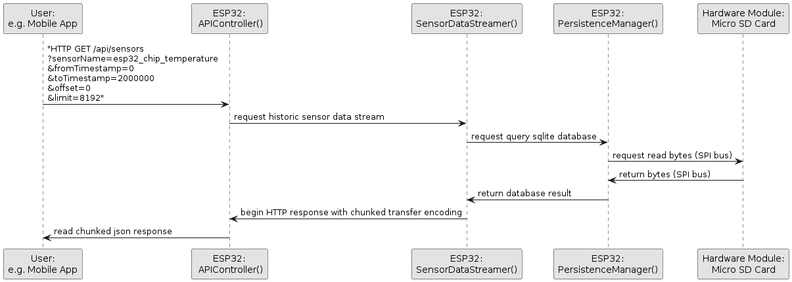
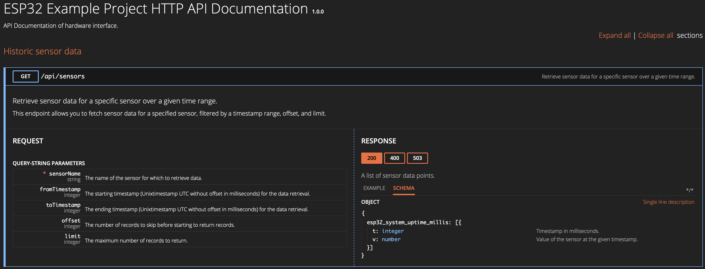

# ESP32 Host an sqlite database and serve large datasets via a paginated HTTP API endpoint with chunked transfer encoding

## About
The wifi-enabled [esp32 microcontroller](https://www.espressif.com/en/products/modules/esp32) opened up great possibilities for embedded systems, especially in the context of IoT applications. The integration of sqlite enhances the very limited storage capabilities of embedded systems. Some projects may require a long term offline storage for historic sensor data, advanced data queries or simply some sort of persistent storage that can hold data across reboots of the IoT device. The purpose of this repository is to demonstrate how to utilize [sqlite](https://github.com/siara-cc/esp32_arduino_sqlite3_lib) and an [asynchronous webserver](https://github.com/me-no-dev/ESPAsyncWebServer) to overcome the storage limitations in embedded IoT projects.

## Hardware requirements
This project is designed to work with esp32 microcontroller. It was not yet tested for esp8266. A micro sd card is connected to the microcontroller via the SPI bus, although this is not a hard requirement.
An SQLite database could theoretically live on the internal storage of the microcontroller (e.g SPIFFS partition). This works fine for small datasets. If you need to store large amounts of data a micro sd card is the perfect choice.

## Storing data
The [PersistenceManager](esp32/src/PersistenceManager/PersistenceManager.cpp) class is designed to insert sensor data into an sqlite database every minute.
A separate indexed sqlite database is maintained for every sensor (in this example **esp32_chip_temperature**, **esp32_system_uptime_millis** and **esp32_millivolts_pin**).
This approach makes sure to maintain a small database file size for every sensor and improves query performance drastically when dealing with millions of rows. 

## Visualisation
The idea is to query any historical sensor data via a single paginated API endpoint. This diagram shows an example request.

Classes for reference:
 - [ApiController](esp32/src/ApiController/ApiController.cpp)
 - [SensorDataStreamer](esp32/src/SensorDataStreamer/SensorDataStreamer.cpp)
 - [PersistenceManager](esp32/src/PersistenceManager/PersistenceManager.cpp)

## API Documentation
Once the code is flashed to the microcontroller you can navigate to the device in your webbrowser to browse the API specification.


Example: Query the sensor **esp32_chip_temperature** with curl
```
pluto:esp32 macbook$ time curl -s 'http://192.168.178.25/api/sensors?sensorName=esp32_chip_temperature&fromTimestamp=0&toTimestamp=1814999551&offset=0&limit=10' | jq
{
  "esp32_chip_temperature": [
    {
      "t": 1715004847,
      "v": 53.33
    },
    {
      "t": 1715004907,
      "v": 53.31
    },
    {
      "t": 1715004967,
      "v": 53.32
    },
    {
      "t": 1715005027,
      "v": 53.32
    },
    {
      "t": 1715005087,
      "v": 53.34
    },
    {
      "t": 1715005147,
      "v": 53.33
    },
    {
      "t": 1715005207,
      "v": 53.31
    },
    {
      "t": 1715005267,
      "v": 53.30
    },
    {
      "t": 1715005327,
      "v": 53.32
    },
    {
      "t": 1715005387,
      "v": 53.33
    }
  ]
}

real	0m0.167s
user	0m0.010s
sys	0m0.010s
```
A json object is returned from the webserver that is running on the esp32. It contains information about which sensor data was requested along with an array that contains all of the requested values.
The **limit** parameter must not exceed 8192 because of the limited resources available on the microcontroller. Use the **fromTimestamp**, **toTimestamp**, and **offset** parameters to query large datasets.
This was tested with 20 sensors, each sensor having **5.000.000** rows of data available. This makes a total of **100.000.000** rows at **2,81GB**. Each individual row is accessible within about 1-3 seconds during my performance tests.

## Get Started
 - Adjust wifi credentials in class [WirelessConnectionManager](esp32/src/WirelessConnectionManager/WirelessConnectionManager.cpp).
 - Adjust the CS (chip select) pin that is used for micro sd card in class [PersistenceManager](esp32/src/PersistenceManager/PersistenceManager.cpp).
 - Import platformio project and flash the microcontroller.
